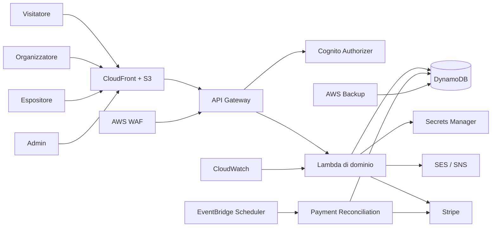
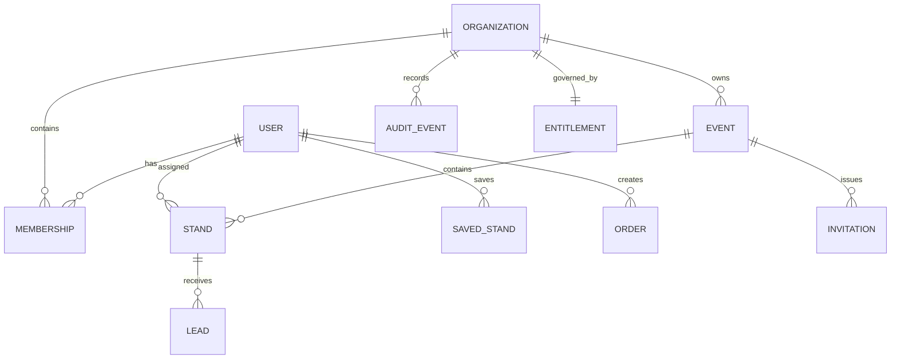

# AI Pavilion 0.9.0-internal-pilot.1 — Documentazione completa dello stato attuale

**Data dello snapshot:** 10 ottobre 2026
**Versione applicativa:** 0.9.0-internal-pilot.1
**Tipo di consegna:** prerelease cumulativa con gate di promozione verso il pilot interno
**Stato dichiarato:** pre-produzione, predisposto per staging controllato, non ancora autorizzato per dati o clienti reali

Aggiornamento operativo: [consolidamento del 10 ottobre 2026](docs/development/CONSOLIDATION-2026-10-10.md), con 332 test Jest passati, coverage sopra tutte le soglie, build riuscita e audit dipendenze a zero. Le evidenze AWS e le approvazioni indipendenti restano aperte.

## 1. Scopo di questo documento

Questo documento riunisce in un’unica fonte italiana lo stato dell’intero progetto AI Pavilion. Non sostituisce i contratti eseguibili, i template infrastrutturali o i runbook: li collega, li interpreta e chiarisce che cosa sia realmente implementato, che cosa sia soltanto predisposto e che cosa appartenga ancora alla visione futura.

La repository conserva anche tutti i rapporti storici delle fasi precedenti, in modo che sia possibile ricostruire l’evoluzione tecnica dal prototipo iniziale alla baseline SaaS multi-tenant attuale.

## 2. Sintesi esecutiva

AI Pavilion è oggi una piattaforma SaaS B2B serverless per eventi virtuali e ibridi. Il prodotto consente a un organizzatore di gestire un tenant isolato, creare eventi, invitare espositori, moderare stand, raccogliere lead e amministrare un abbonamento. Gli espositori modificano gli stand assegnati e vedono soltanto i lead di propria competenza. I visitatori esplorano eventi e stand esplicitamente pubblicati e possono contattare gli espositori senza entrare nel confine amministrativo del tenant.

La visione iniziale comprendeva padiglioni immersivi, AR, tour a 360 gradi, raccomandazioni, recensioni e marketplace multi-vendor. Quella visione non è attualmente realizzata come prodotto commerciale. La strategia corretta, formalizzata nel progetto, è completare prima il core affidabile di eventi, stand, lead, analytics e billing SaaS; le capacità immersive, AI e marketplace restano estensioni future.

La prerelease `0.9.0-internal-pilot.1` conserva i sei blocchi di Core Correctness, consolida nel runtime error contract, session lifecycle, Turnstile contestuale, minimizzazione IP, publishing saga e barriera pubblica, e aggiunge un gate di promozione che accetta soltanto evidenze PASS riferite allo stesso commit, ambiente e release. L’assenza di strumenti, credenziali, prove distribuite o approvazioni produce PENDING e impedisce il pilot.

## 3. Stato complessivo

| Area                         | Stato                                                | Cosa esiste                                                                                                                   | Cosa manca                                                                      |
| ---------------------------- | ---------------------------------------------------- | ----------------------------------------------------------------------------------------------------------------------------- | ------------------------------------------------------------------------------- |
| Organizzazioni multi-tenant  | Implementato nel codice                              | Membership, ruoli, ownership transfer e isolamento server-side.                                                               | Test distribuiti ancora da eseguire su AWS reale.                               |
| Eventi                       | Implementato nel codice                              | Creazione, modifica, duplicazione, pubblicazione, archiviazione e visibilità pubblica.                                        | Verifica di concorrenza e carico da completare.                                 |
| Inviti espositori            | Implementato nel codice                              | SESv2, accettazione, revoca, reinvio e telemetria.                                                                            | Consegna reale SES e gestione reputazione da dimostrare.                        |
| Portale organizzatore        | Implementato nel frontend                            | Onboarding, team, eventi, inviti, moderazione, audit e billing.                                                               | Usabilità e accessibilità manuali da completare.                                |
| Portale espositore           | Implementato nel frontend                            | Stand assegnati, invio revisione, contatti pubblici opt-in e lead.                                                            | Test con utenti reali ancora mancanti.                                          |
| Catalogo pubblico            | Implementato fail-closed                             | Eventi/stand pubblicati, prodotti visibili, ricerca paginata e lead.                                                          | Ricerca adatta a scala pilot, non a cataloghi molto grandi.                     |
| Autenticazione Cognito       | AUTH-01 implementato nel codice                      | Access token con scope `user`, `tenant` e `platform-admin`, Pre Token Generation V2.0, TOTP MFA, password temporanea e reset. | Trigger, scope e rifiuto degli ID token devono ancora essere dimostrati su AWS. |
| Cancellazione account        | Implementato con bloccanti                           | Blocca owner e stand assegnati; anonimizza/elimina dati previsti.                                                             | Revisione privacy/legale e casi estremi da completare.                          |
| Billing SaaS                 | Implementato nel codice                              | Checkout Stripe, Billing Portal, webhook, entitlement e riconciliazione.                                                      | Stripe test mode reale e ritardi webhook da dimostrare.                         |
| Checkout prodotti espositori | Presente ma disabilitato nel pilot                   | Usato per sviluppo controllato e test del modello ordini.                                                                     | Non è un marketplace: mancano Connect, payout, fiscalità e fulfillment.         |
| Audit                        | Implementato e transazionale per i flussi principali | Audit tenant-scoped e viewer autorizzato.                                                                                     | Verifica completa di retention e immutabilità operativa da completare.          |
| WAF e rate limiting          | Definiti in IaC                                      | Managed rules e regola rate-based.                                                                                            | Comportamento reale sotto traffico non misurato.                                |
| Backup e restore             | Definiti in IaC e runbook                            | AWS Backup, PITR DynamoDB e restore drill.                                                                                    | Ripristino con RPO/RTO misurati non ancora eseguito.                            |
| Accessibilità                | Fondazione implementata                              | Tastiera, focus, skip link, live region, reduced motion, CSP stretta.                                                         | Audit manuale WCAG 2.2 AA e screen reader ancora aperti.                        |
| Intelligenza artificiale     | Non implementata come capacità di prodotto           | Visione futura: semantic search, assistenza contenuti, raccomandazioni e sintesi.                                             | Da progettare solo dopo validazione del core.                                   |
| AR e tour 360°               | Non presenti come prodotto commerciale               | Restano nella visione originaria.                                                                                             | Da reintrodurre come moduli futuri dopo il pilot.                               |
| Staging AWS                  | Automazione predisposta                              | Tre stack, bootstrap CloudFront, migrazioni, synthetic ed evidenze.                                                           | Deployment reale completo non dimostrato in questa sessione.                    |

## 4. Utenti e flussi principali

### 4.1 Amministratore di piattaforma

L’amministratore globale controlla dashboard, stand, utenti, ordini e analytics. L’accesso richiede un access token Cognito valido e l’appartenenza al gruppo amministrativo. Questa superficie è distinta dai ruoli dei tenant.

### 4.2 Proprietario dell’organizzazione

Il proprietario crea o riceve il controllo dell’organizzazione, completa l’onboarding, gestisce membri e ruoli, trasferisce l’ownership, crea eventi, invita espositori, modera gli stand, consulta audit e billing e può aprire il portale Stripe.

### 4.3 Organizzatore

L’organizzatore collabora sul tenant: crea e gestisce eventi, invita espositori, modera stand, consulta audit e lead secondo le regole del piano. Non può aggirare le protezioni riservate all’owner, come la rimozione dell’ultimo proprietario.

### 4.4 Espositore

L’espositore accetta un invito, ottiene una membership attiva e uno stand assegnato, modifica i contenuti, sceglie quali contatti rendere pubblici, invia lo stand in revisione e gestisce i lead collegati ai propri stand.

### 4.5 Visitatore autenticato

Il visitatore può salvare stand, consultare ordini e statistiche personali, esportare i propri dati e richiedere la cancellazione dell’account. La cancellazione viene bloccata quando l’utente possiede ancora un’organizzazione o stand assegnati.

### 4.6 Visitatore anonimo

Il visitatore anonimo può consultare eventi e stand pubblici, eseguire ricerche e inviare lead. Le richieste pubbliche sono sottoposte a validazione, idempotenza, honeypot e challenge anti-bot configurabile.

## 5. Architettura logica



### Principi architetturali

- **Serverless:** API Gateway, Lambda, DynamoDB e servizi AWS gestiti.
- **Multi-tenancy applicativa:** ogni risorsa protetta viene verificata rispetto a organizzazione, membership e ownership.
- **Contratti espliciti:** OpenAPI 3.1 e controlli di parità con SAM.
- **Fail-closed:** eventi e stand sono pubblici solo quando ogni segnale richiesto è esplicitamente valido.
- **Idempotenza e riconciliazione:** lead, checkout e webhook usano chiavi o lease persistenti.
- **Separazione del prodotto:** billing SaaS attivo; marketplace multi-vendor escluso dal pilot.

## 6. Componenti backend

| Risorsa SAM                   | Handler                              | Responsabilità                                                                                                                                                                           | Eventi/rotte                                                                                                                                                                                                                                                                                                                                                                                                                                                                                                                                       | Dipendenze configurate                                                                                                                                                                                                                                           |
| ----------------------------- | ------------------------------------ | ---------------------------------------------------------------------------------------------------------------------------------------------------------------------------------------- | -------------------------------------------------------------------------------------------------------------------------------------------------------------------------------------------------------------------------------------------------------------------------------------------------------------------------------------------------------------------------------------------------------------------------------------------------------------------------------------------------------------------------------------------------- | ---------------------------------------------------------------------------------------------------------------------------------------------------------------------------------------------------------------------------------------------------------------- |
| GetStandsFunction             | get-stands/index.handler             | Elenca gli stand pubblici con pubblicazione fail-closed e paginazione.                                                                                                                   | GET /stands                                                                                                                                                                                                                                                                                                                                                                                                                                                                                                                                        | EVENT_STANDS_INDEX, PUBLIC_STANDS_INDEX, STANDS_TABLE                                                                                                                                                                                                            |
| GetStandDetailFunction        | get-stand-detail/index.handler       | Restituisce la proiezione pubblica di un singolo stand.                                                                                                                                  | GET /stands/{standId}                                                                                                                                                                                                                                                                                                                                                                                                                                                                                                                              | STANDS_TABLE                                                                                                                                                                                                                                                     |
| SearchStandsFunction          | search-stands/index.handler          | Ricerca nel catalogo pubblico attraversando le pagine DynamoDB.                                                                                                                          | GET /stands/search                                                                                                                                                                                                                                                                                                                                                                                                                                                                                                                                 | EVENT_STANDS_INDEX, PUBLIC_STANDS_INDEX, STANDS_TABLE                                                                                                                                                                                                            |
| CheckoutFunction              | checkout/index.handler               | Gestisce il checkout dei prodotti, gli ordini e il webhook Stripe; nel pilot persistente è disabilitato per impostazione predefinita.                                                    | POST /checkout/create-intent<br>POST /checkout/confirm-order<br>GET /checkout/order/{orderId}<br>POST /checkout/webhook                                                                                                                                                                                                                                                                                                                                                                                                                            | ORDERS_TABLE, PAYMENT_EVENTS_TABLE, PAYMENT_MODE, STANDS_TABLE, STRIPE_SECRET_KEY_ARN                                                                                                                                                                            |
| AdminFunction                 | admin/index.handler                  | Espone dashboard e viste read-only di stand, utenti, ordini e analytics per amministratori di piattaforma. Le mutazioni degli stand passano esclusivamente dai workflow tenant canonici. | GET /admin/dashboard<br>GET /admin/stands<br>GET /admin/stands/{standId}<br>GET /admin/users<br>GET /admin/orders<br>GET /admin/analytics                                                                                                                                                                                                                                                                                                                                                                                                          | COGNITO_CLIENT_ID, COGNITO_USER_POOL_ID, INTERACTIONS_TABLE, ORDERS_TABLE, STANDS_TABLE, USERS_TABLE                                                                                                                                                             |
| UserSavedStandsFunction       | user-saved-stands/index.handler      | Gestisce i preferiti dell’utente autenticato.                                                                                                                                            | GET /user/saved-stands<br>POST /user/saved-stands<br>DELETE /user/saved-stands/{standId}                                                                                                                                                                                                                                                                                                                                                                                                                                                           | SAVED_AT_INDEX, SAVED_STANDS_TABLE, STANDS_TABLE                                                                                                                                                                                                                 |
| UserAccountFunction           | user-account/index.handler           | Espone stato dell’account, bloccanti alla cancellazione e cancellazione sicura.                                                                                                          | GET /user/account<br>DELETE /user/account                                                                                                                                                                                                                                                                                                                                                                                                                                                                                                          | COGNITO_USER_POOL_ID, MEMBERSHIPS_TABLE, ORDERS_TABLE, OWNER_STANDS_INDEX, SAVED_STANDS_TABLE, STANDS_TABLE, USERS_TABLE                                                                                                                                         |
| UserOrdersFunction            | user-orders/index.handler            | Elenca gli ordini appartenenti all’utente autenticato.                                                                                                                                   | GET /user/orders                                                                                                                                                                                                                                                                                                                                                                                                                                                                                                                                   | ORDERS_TABLE, USER_ORDERS_INDEX                                                                                                                                                                                                                                  |
| UserStatsFunction             | user-stats/index.handler             | Calcola statistiche personali basate su ordini pagati e preferiti.                                                                                                                       | GET /user/stats                                                                                                                                                                                                                                                                                                                                                                                                                                                                                                                                    | ORDERS_TABLE, SAVED_STANDS_TABLE                                                                                                                                                                                                                                 |
| ContactStandFunction          | contact-stand/index.handler          | Riceve lead pubblici con validazione, idempotenza, honeypot e challenge anti-bot configurabile.                                                                                          | POST /stands/contact                                                                                                                                                                                                                                                                                                                                                                                                                                                                                                                               | BOT_CHALLENGE_MODE, BOT_CHALLENGE_SECRET_ARN, LEADS_TABLE, STANDS_TABLE                                                                                                                                                                                          |
| TrackInteractionFunction      | track-interaction/index.handler      | Registra interazioni pubbliche consentite, non economiche e validate.                                                                                                                    | POST /interactions                                                                                                                                                                                                                                                                                                                                                                                                                                                                                                                                 | STANDS_TABLE, TABLE_INTERACTIONS                                                                                                                                                                                                                                 |
| OrganizationsFunction         | organizations/index.handler          | Gestisce organizzazioni, membership, ownership transfer ed entitlement.                                                                                                                  | GET /me/memberships<br>POST /platform/organizations<br>ANY /organizations/{organizationId}<br>POST /organizations/{organizationId}/ownership-transfer<br>ANY /organizations/{organizationId}/memberships<br>ANY /organizations/{organizationId}/memberships/{userId}<br>GET /organizations/{organizationId}/entitlement                                                                                                                                                                                                                            | AUDIT_TABLE, ENTITLEMENTS_TABLE, MEMBERSHIPS_TABLE, ORGANIZATIONS_TABLE, ORGANIZATION_MEMBERS_INDEX, USERS_TABLE                                                                                                                                                 |
| EventsFunction                | events/index.handler                 | Gestisce ciclo di vita eventi, pubblicazione, archiviazione, duplicazione, assegnazione e moderazione stand.                                                                             | ANY /organizations/{organizationId}/events<br>ANY /organizations/{organizationId}/events/{eventId}<br>POST /organizations/{organizationId}/events/{eventId}/duplicate<br>POST /organizations/{organizationId}/events/{eventId}/archive<br>POST /organizations/{organizationId}/events/{eventId}/publish<br>GET /organizations/{organizationId}/events/{eventId}/stands<br>PATCH /organizations/{organizationId}/events/{eventId}/stands/{standId}/assignment<br>PATCH /organizations/{organizationId}/events/{eventId}/stands/{standId}/moderation | AUDIT_TABLE, ENTITLEMENTS_TABLE, EVENTS_TABLE, EVENT_STANDS_INDEX, MEMBERSHIPS_TABLE, ORGANIZATION_EVENTS_INDEX, STANDS_TABLE                                                                                                                                    |
| InvitationsFunction           | invitations/index.handler            | Gestisce inviti, invio SES, accettazione, revoca e reinvio.                                                                                                                              | ANY /organizations/{organizationId}/events/{eventId}/invitations<br>ANY /organizations/{organizationId}/events/{eventId}/invitations/{invitationId}<br>POST /organizations/{organizationId}/events/{eventId}/invitations/{invitationId}/resend<br>POST /invitations/{invitationId}/accept                                                                                                                                                                                                                                                          | APP_URL, AUDIT_TABLE, EMAIL_CONFIGURATION_SET, ENTITLEMENTS_TABLE, EVENTS_TABLE, EVENT_INVITATIONS_INDEX, EVENT_STANDS_INDEX, INVITATIONS_TABLE, INVITATION_EMAIL_FROM, INVITATION_EMAIL_MODE, MEMBERSHIPS_TABLE, ORGANIZATIONS_TABLE, STANDS_TABLE, USERS_TABLE |
| ExhibitorStandsFunction       | exhibitor-stands/index.handler       | Consente all’espositore di leggere e modificare gli stand assegnati e inviarli in revisione.                                                                                             | GET /exhibitor/stands<br>ANY /exhibitor/stands/{standId}<br>POST /exhibitor/stands/{standId}/submit                                                                                                                                                                                                                                                                                                                                                                                                                                                | AUDIT_TABLE, EVENTS_TABLE, OWNER_STANDS_INDEX, STANDS_TABLE                                                                                                                                                                                                      |
| ExhibitorLeadsFunction        | exhibitor-leads/index.handler        | Consente all’espositore di consultare, esportare e aggiornare i lead dei propri stand.                                                                                                   | GET /exhibitor/leads<br>GET /exhibitor/leads/export<br>PATCH /exhibitor/leads/{leadId}                                                                                                                                                                                                                                                                                                                                                                                                                                                             | AUDIT_TABLE, LEADS_TABLE, MEMBERSHIPS_TABLE, STANDS_TABLE, STAND_LEADS_INDEX                                                                                                                                                                                     |
| PublicEventsFunction          | public-events/index.handler          | Espone eventi pubblici e relativi stand.                                                                                                                                                 | GET /events<br>GET /events/{eventId}<br>GET /events/{eventId}/stands                                                                                                                                                                                                                                                                                                                                                                                                                                                                               | EVENTS_TABLE, EVENT_STANDS_INDEX, PUBLIC_EVENTS_INDEX, STANDS_TABLE                                                                                                                                                                                              |
| BillingFunction               | billing/index.handler                | Gestisce billing SaaS Stripe, Checkout, Billing Portal, webhook e entitlement.                                                                                                           | GET /organizations/{organizationId}/billing<br>POST /organizations/{organizationId}/billing/checkout<br>POST /organizations/{organizationId}/billing/portal<br>POST /billing/webhook                                                                                                                                                                                                                                                                                                                                                               | APP_URL, AUDIT_TABLE, BILLING_MODE, ENTITLEMENTS_TABLE, MEMBERSHIPS_TABLE, ORGANIZATIONS_TABLE, PAYMENT_EVENTS_TABLE, STRIPE_PRICE_MAP, STRIPE_SECRET_KEY_ARN                                                                                                    |
| EmailEventsFunction           | email-events/index.handler           | Elabora la telemetria SES/SNS relativa agli inviti.                                                                                                                                      | SNS:InvitationEmailEvents                                                                                                                                                                                                                                                                                                                                                                                                                                                                                                                          | AUDIT_TABLE, INVITATIONS_TABLE                                                                                                                                                                                                                                   |
| AuditViewFunction             | audit-view/index.handler             | Espone l’audit trail dell’organizzazione ai ruoli autorizzati.                                                                                                                           | GET /organizations/{organizationId}/audit                                                                                                                                                                                                                                                                                                                                                                                                                                                                                                          | AUDIT_TABLE, MEMBERSHIPS_TABLE, ORGANIZATION_AUDIT_INDEX                                                                                                                                                                                                         |
| DataExportFunction            | data-export/index.handler            | Genera l’esportazione dei dati personali dell’utente.                                                                                                                                    | GET /user/export                                                                                                                                                                                                                                                                                                                                                                                                                                                                                                                                   | MEMBERSHIPS_TABLE, ORDERS_TABLE, SAVED_STANDS_TABLE, USERS_TABLE, USER_ORDERS_INDEX, USER_SAVED_INDEX                                                                                                                                                            |
| PaymentReconciliationFunction | payment-reconciliation/index.handler | Riconcilia periodicamente webhook, ordini ed entitlement con Stripe.                                                                                                                     | Schedule:Schedule                                                                                                                                                                                                                                                                                                                                                                                                                                                                                                                                  | BILLING_MODE, ENTITLEMENTS_TABLE, ORDERS_TABLE, PAYMENT_EVENTS_TABLE, PAYMENT_MODE, RECONCILIATION_MAX_ITEMS, RECONCILIATION_MAX_SCAN_PAGES, STALE_ORDER_MINUTES, STRIPE_SECRET_KEY_ARN                                                                          |
| PreTokenGenerationFunction    | pre-token-generation/index.handler   | Aggiunge gli scope applicativi agli access token Cognito V2.0; lo scope amministrativo richiede il gruppo Cognito `admin`.                                                               | Trigger Cognito Pre Token Generation                                                                                                                                                                                                                                                                                                                                                                                                                                                                                                               | —                                                                                                                                                                                                                                                                |
| ProfileSyncFunction           | profile-sync/index.handler           | Crea o sincronizza il profilo applicativo dopo la conferma Cognito.                                                                                                                      | Trigger Cognito Post Confirmation                                                                                                                                                                                                                                                                                                                                                                                                                                                                                                                  | USERS_TABLE                                                                                                                                                                                                                                                      |

## 7. Modello dati

| Risorsa               | Nome fisico                         | Contenuto                                                                                        | Indici                                                                      |
| --------------------- | ----------------------------------- | ------------------------------------------------------------------------------------------------ | --------------------------------------------------------------------------- |
| StandsTable           | ${AWS::StackName}-stands            | Stand, prodotti incorporati, stato di moderazione, visibilità pubblica, assegnazione espositore. | category-index, event-stands-index, public-stands-index, owner-stands-index |
| OrdersTable           | ${AWS::StackName}-orders            | Ordini visitatore e stato di pagamento.                                                          | user-orders-index                                                           |
| PaymentEventsTable    | ${AWS::StackName}-payment-events    | Deduplicazione, lease e stato dei webhook Stripe.                                                | —                                                                           |
| UsersTable            | ${AWS::StackName}-users             | Profilo applicativo associato all’identità Cognito.                                              | —                                                                           |
| LeadsTable            | ${AWS::StackName}-leads             | Richieste di contatto generate dai visitatori.                                                   | stand-leads-index, organization-leads-index                                 |
| InteractionsTable     | ${AWS::StackName}-interactions      | Eventi di engagement non economici.                                                              | stand-created-index, event-created-index                                    |
| SavedStandsTable      | ${AWS::StackName}-saved-stands      | Preferiti degli utenti.                                                                          | user-saved-at-index                                                         |
| OrganizationsTable    | ${AWS::StackName}-organizations     | Tenant cliente, piano, onboarding e owner.                                                       | organization-slug-index                                                     |
| MembershipsTable      | ${AWS::StackName}-memberships       | Appartenenza e ruolo dell’utente nell’organizzazione.                                            | organization-members-index                                                  |
| EventsTable           | ${AWS::StackName}-events            | Eventi virtuali/ibridi, ciclo di pubblicazione e visibilità.                                     | organization-events-index, public-events-index                              |
| InvitationsTable      | ${AWS::StackName}-invitations       | Inviti per espositori e collaboratori, stato di consegna.                                        | email-invitations-index, event-invitations-index                            |
| EntitlementsTable     | ${AWS::StackName}-entitlements      | Piano SaaS, limiti e stato di sincronizzazione Stripe.                                           | —                                                                           |
| AuditEventsTable      | ${AWS::StackName}-audit-events      | Audit trail tenant-scoped.                                                                       | organization-audit-index                                                    |
| SchemaMigrationsTable | ${AWS::StackName}-schema-migrations | Versioni e stato delle migrazioni dati.                                                          | —                                                                           |

### 7.1 Relazioni concettuali



### 7.2 Scelte rilevanti

I prodotti sono ancora incorporati negli item degli stand. Questa soluzione è sufficiente per il pilot, ma dovrà essere rivalutata se il catalogo cresce, perché ogni item DynamoDB ha un limite dimensionale e l’aggiornamento di un prodotto riscrive l’aggregato stand.

La ricerca usa indici DynamoDB e attraversa le pagine fino a trovare il numero richiesto di risultati. È corretta per la scala pilot, ma non equivale a un motore full-text.

## 8. Superficie API

La fonte autorevole è `docs/api/openapi.json`; `template.yaml` definisce l’infrastruttura effettiva. I controlli automatici verificano la parità.

| Area                                       | Metodo | Rotta                                                                              | Scopo                                                            | Protezione                           |
| ------------------------------------------ | ------ | ---------------------------------------------------------------------------------- | ---------------------------------------------------------------- | ------------------------------------ |
| Account visitatore                         | DELETE | /user/account                                                                      | Delete and anonymize an account                                  | Cognito/access token o firma webhook |
| Account visitatore                         | GET    | /user/account                                                                      | Check whether the current account can be deleted                 | Cognito/access token o firma webhook |
| Account visitatore                         | GET    | /user/export                                                                       | Export the authenticated user data in a portable JSON document   | Cognito/access token o firma webhook |
| Account visitatore                         | GET    | /user/orders                                                                       | List owned orders                                                | Cognito/access token o firma webhook |
| Account visitatore                         | GET    | /user/saved-stands                                                                 | List saved public stands                                         | Cognito/access token o firma webhook |
| Account visitatore                         | POST   | /user/saved-stands                                                                 | Save canonical server-side stand metadata                        | Cognito/access token o firma webhook |
| Account visitatore                         | DELETE | /user/saved-stands/{standId}                                                       | Delete a saved stand                                             | Cognito/access token o firma webhook |
| Account visitatore                         | GET    | /user/stats                                                                        | Get settled user statistics                                      | Cognito/access token o firma webhook |
| Amministrazione piattaforma                | GET    | /admin/analytics                                                                   | Aggregate interactions for a bounded period                      | Cognito/access token o firma webhook |
| Amministrazione piattaforma                | GET    | /admin/dashboard                                                                   | Get paid revenue and platform overview                           | Cognito/access token o firma webhook |
| Amministrazione piattaforma                | GET    | /admin/orders                                                                      | List sanitized orders                                            | Cognito/access token o firma webhook |
| Amministrazione piattaforma                | GET    | /admin/stands                                                                      | List stands for moderation                                       | Cognito/access token o firma webhook |
| Amministrazione piattaforma                | GET    | /admin/stands/{standId}                                                            | Get any stand administratively                                   | Cognito/access token o firma webhook |
| Amministrazione piattaforma                | GET    | /admin/users                                                                       | List sanitized Cognito users                                     | Cognito/access token o firma webhook |
| Catalogo pubblico e lead                   | GET    | /events                                                                            | List public published events                                     | Pubblica                             |
| Catalogo pubblico e lead                   | GET    | /events/{eventId}                                                                  | Get a public published event                                     | Pubblica                             |
| Catalogo pubblico e lead                   | GET    | /events/{eventId}/stands                                                           | List public stands in an event                                   | Pubblica                             |
| Catalogo pubblico e lead                   | POST   | /interactions                                                                      | Record a non-economic interaction                                | Pubblica                             |
| Catalogo pubblico e lead                   | GET    | /stands                                                                            | List public stands                                               | Pubblica                             |
| Catalogo pubblico e lead                   | POST   | /stands/contact                                                                    | Create an exhibitor lead                                         | Pubblica                             |
| Catalogo pubblico e lead                   | GET    | /stands/search                                                                     | Search public stands                                             | Pubblica                             |
| Catalogo pubblico e lead                   | GET    | /stands/{standId}                                                                  | Get a public stand                                               | Pubblica                             |
| Checkout prodotti (disabilitato nel pilot) | POST   | /checkout/confirm-order                                                            | Confirm an owned order                                           | Cognito/access token o firma webhook |
| Checkout prodotti (disabilitato nel pilot) | POST   | /checkout/create-intent                                                            | Reserve an order and create or replay its payment intent         | Cognito/access token o firma webhook |
| Checkout prodotti (disabilitato nel pilot) | GET    | /checkout/order/{orderId}                                                          | Read an owned safe order representation                          | Cognito/access token o firma webhook |
| Checkout prodotti (disabilitato nel pilot) | POST   | /checkout/webhook                                                                  | Receive a signed Stripe webhook                                  | Pubblica                             |
| Espositore e inviti                        | GET    | /exhibitor/leads                                                                   | List leads for an owned stand                                    | Cognito/access token o firma webhook |
| Espositore e inviti                        | GET    | /exhibitor/leads/export                                                            | Export leads for an owned stand as CSV                           | Cognito/access token o firma webhook |
| Espositore e inviti                        | PATCH  | /exhibitor/leads/{leadId}                                                          | Update lead workflow state                                       | Cognito/access token o firma webhook |
| Espositore e inviti                        | GET    | /exhibitor/stands                                                                  | List stands owned by the exhibitor                               | Cognito/access token o firma webhook |
| Espositore e inviti                        | GET    | /exhibitor/stands/{standId}                                                        | Get a stand owned by the exhibitor                               | Cognito/access token o firma webhook |
| Espositore e inviti                        | PUT    | /exhibitor/stands/{standId}                                                        | Update a stand owned by the exhibitor                            | Cognito/access token o firma webhook |
| Espositore e inviti                        | POST   | /exhibitor/stands/{standId}/submit                                                 | Submit a stand for organizer review                              | Cognito/access token o firma webhook |
| Espositore e inviti                        | POST   | /invitations/{invitationId}/accept                                                 | Accept an exhibitor invitation                                   | Cognito/access token o firma webhook |
| Organizzazioni, eventi e billing           | GET    | /me/memberships                                                                    | List memberships for the signed-in user                          | Cognito/access token o firma webhook |
| Organizzazioni, eventi e billing           | GET    | /organizations/{organizationId}                                                    | Get an accessible organization                                   | Cognito/access token o firma webhook |
| Organizzazioni, eventi e billing           | PATCH  | /organizations/{organizationId}                                                    | Complete or update organization onboarding                       | Cognito/access token o firma webhook |
| Organizzazioni, eventi e billing           | GET    | /organizations/{organizationId}/audit                                              | List tenant-scoped audit events                                  | Cognito/access token o firma webhook |
| Organizzazioni, eventi e billing           | GET    | /organizations/{organizationId}/billing                                            | Get sanitized billing entitlement                                | Cognito/access token o firma webhook |
| Organizzazioni, eventi e billing           | POST   | /organizations/{organizationId}/billing/checkout                                   | Create a SaaS subscription checkout session                      | Cognito/access token o firma webhook |
| Organizzazioni, eventi e billing           | POST   | /organizations/{organizationId}/billing/portal                                     | Create a Stripe billing portal session                           | Cognito/access token o firma webhook |
| Organizzazioni, eventi e billing           | GET    | /organizations/{organizationId}/entitlement                                        | Get organization plan entitlements                               | Cognito/access token o firma webhook |
| Organizzazioni, eventi e billing           | GET    | /organizations/{organizationId}/events                                             | List events in an organization                                   | Cognito/access token o firma webhook |
| Organizzazioni, eventi e billing           | POST   | /organizations/{organizationId}/events                                             | Create an event in an organization                               | Cognito/access token o firma webhook |
| Organizzazioni, eventi e billing           | GET    | /organizations/{organizationId}/events/{eventId}                                   | Get an organization event                                        | Cognito/access token o firma webhook |
| Organizzazioni, eventi e billing           | PUT    | /organizations/{organizationId}/events/{eventId}                                   | Update an organization event                                     | Cognito/access token o firma webhook |
| Organizzazioni, eventi e billing           | POST   | /organizations/{organizationId}/events/{eventId}/archive                           | Archive an event and remove its stands from the public catalogue | Cognito/access token o firma webhook |
| Organizzazioni, eventi e billing           | POST   | /organizations/{organizationId}/events/{eventId}/duplicate                         | Duplicate an event into a new draft                              | Cognito/access token o firma webhook |
| Organizzazioni, eventi e billing           | GET    | /organizations/{organizationId}/events/{eventId}/invitations                       | List event invitations and delivery status                       | Cognito/access token o firma webhook |
| Organizzazioni, eventi e billing           | POST   | /organizations/{organizationId}/events/{eventId}/invitations                       | Invite an exhibitor to an event                                  | Cognito/access token o firma webhook |
| Organizzazioni, eventi e billing           | DELETE | /organizations/{organizationId}/events/{eventId}/invitations/{invitationId}        | Revoke a pending exhibitor invitation                            | Cognito/access token o firma webhook |
| Organizzazioni, eventi e billing           | POST   | /organizations/{organizationId}/events/{eventId}/invitations/{invitationId}/resend | Extend and resend a pending exhibitor invitation                 | Cognito/access token o firma webhook |
| Organizzazioni, eventi e billing           | POST   | /organizations/{organizationId}/events/{eventId}/publish                           | Publish an organization event                                    | Cognito/access token o firma webhook |
| Organizzazioni, eventi e billing           | GET    | /organizations/{organizationId}/events/{eventId}/stands                            | List stands for organization event moderation                    | Cognito/access token o firma webhook |
| Organizzazioni, eventi e billing           | PATCH  | /organizations/{organizationId}/events/{eventId}/stands/{standId}/assignment       | Reassign a stand to an active organization member                | Cognito/access token o firma webhook |
| Organizzazioni, eventi e billing           | PATCH  | /organizations/{organizationId}/events/{eventId}/stands/{standId}/moderation       | Approve or reject a submitted stand                              | Cognito/access token o firma webhook |
| Organizzazioni, eventi e billing           | GET    | /organizations/{organizationId}/memberships                                        | List organization memberships                                    | Cognito/access token o firma webhook |
| Organizzazioni, eventi e billing           | POST   | /organizations/{organizationId}/memberships                                        | Grant an organization membership                                 | Cognito/access token o firma webhook |
| Organizzazioni, eventi e billing           | DELETE | /organizations/{organizationId}/memberships/{userId}                               | Remove a non-owner member                                        | Cognito/access token o firma webhook |
| Organizzazioni, eventi e billing           | PATCH  | /organizations/{organizationId}/memberships/{userId}                               | Change a member role or status                                   | Cognito/access token o firma webhook |
| Organizzazioni, eventi e billing           | POST   | /organizations/{organizationId}/ownership-transfer                                 | Transfer organization ownership to an active organizer           | Cognito/access token o firma webhook |
| Organizzazioni, eventi e billing           | POST   | /platform/organizations                                                            | Create a tenant organization                                     | Cognito/access token o firma webhook |
| Webhook billing SaaS                       | POST   | /billing/webhook                                                                   | Receive signed Stripe subscription events                        | Pubblica                             |

## 9. Frontend

| Modulo frontend                | Responsabilità                                                                         |
| ------------------------------ | -------------------------------------------------------------------------------------- |
| account/auth.js                | Autenticazione Cognito, challenge MFA, password temporanea, reset e gestione sessione. |
| account/dashboard-templates.js | Template della dashboard account.                                                      |
| account/dashboard.js           | Dashboard visitatore, preferiti, ordini, export e cancellazione account.               |
| app.js                         | Bootstrap SPA, router hash, coordinamento delle viste e feature flags.                 |
| checkout/cart.js               | Carrello locale e stato dei prodotti selezionati.                                      |
| checkout/checkout.js           | Orchestrazione del checkout prodotti; nascosto quando disabilitato.                    |
| checkout/stripe.js             | Caricamento dinamico e integrazione Stripe lato browser.                               |
| core/api.js                    | Client HTTP, access token Cognito, retry controllato ed errori.                        |
| core/config.js                 | Configurazione runtime generata dagli output dello stack.                              |
| core/constants.js              | Costanti condivise.                                                                    |
| core/external.js               | Caricamento sicuro di dipendenze esterne opzionali.                                    |
| core/helpers.js                | Utility generali e sanitizzazione.                                                     |
| core/templates.js              | Template UI comuni.                                                                    |
| core/validators.js             | Validazione dei dati lato browser.                                                     |
| events/public.js               | Elenco e dettaglio degli eventi pubblici.                                              |
| stands/card.js                 | Card accessibili degli stand.                                                          |
| stands/detail.js               | Dettaglio pubblico dello stand e invio lead.                                           |
| stands/search.js               | Ricerca pubblica e navigazione risultati.                                              |
| styles.css                     | Stili Tailwind e regole accessibilità.                                                 |
| tenant/portal-templates.js     | Template dei portali organizzatore/espositore.                                         |
| tenant/portal.js               | Onboarding, team, eventi, inviti, stand, lead, audit e billing.                        |
| ui/ui.js                       | Gestione di messaggi, caricamenti, modali e stati globali.                             |

Il frontend è una SPA Vite con routing hash. Tailwind viene compilato localmente. Stripe e Turnstile vengono caricati solo quando richiesti. Gli handler e gli stili inline sono stati rimossi dalla superficie attiva, consentendo una CSP più restrittiva.

## 10. Autenticazione e autorizzazione

Cognito gestisce registrazione, conferma, login, TOTP MFA, password temporanea, recupero e cambio password. Le API protette ricevono un access token; il browser non assegna mai ruoli a se stesso.

Il User Pool seleziona esplicitamente il piano `ESSENTIALS`. Un trigger Pre Token Generation V2.0 aggiunge scope grossolani agli access token:

- `aipavilion/user` per account, membership personali, accettazione inviti e checkout protetto;
- `aipavilion/tenant` per organizzazioni ed espositori;
- `aipavilion/platform-admin` soltanto per il gruppo Cognito `admin`.

API Gateway richiede lo scope appropriato su tutte le 46 rotte protette. Lo scope non costituisce una membership e non sostituisce l’autorizzazione applicativa.

L’identità canonica è il claim `sub`. L’accettazione degli inviti legge il profilo da `UsersTable` e confronta l’email normalizzata server-side, senza dipendere da un claim email nell’access token.

Ogni handler protetto ricava l’identità verificata, carica membership e risorsa e controlla:

- stato attivo della membership;
- organizzazione corretta;
- ruolo richiesto;
- proprietà di evento, stand, invito o lead;
- eventuali limiti del piano.

Il trasferimento di ownership è transazionale. La cancellazione account presenta una readiness check e rifiuta l’ultimo owner o l’utente con stand assegnati.

## 11. Pubblicazione e privacy del catalogo

Uno stand pubblico richiede esplicitamente stato pubblicato, moderazione approvata, visibilità pubblica, evento pubblicato, stato pubblico pubblicato e chiave di pubblicazione coerente. Un valore mancante nasconde la risorsa.

Email, telefono e sito sono opt-in separati. Il form lead rimane disponibile anche senza esporre contatti diretti. I prodotti nascosti sono esclusi sia dalle risposte pubbliche sia dal testo di ricerca.

## 12. Billing e pagamenti

### Billing SaaS

Stripe viene utilizzato per i piani dell’organizzatore. Il backend possiede mappa prezzi, piano, entitlement e stato. Il webhook è firmato, deduplicato, dotato di lease e protetto da eventi fuori ordine. Un riconciliatore pianificato confronta lo stato persistito con Stripe.

### Checkout prodotti

Il checkout prodotti rimane nel codice per sviluppo controllato, ma è disabilitato per impostazione predefinita nello staging persistente. Non deve essere presentato come marketplace: non sono presenti Stripe Connect, payout, commissioni, fiscalità, stock o fulfillment.

## 13. Consistenza, audit e processi asincroni

Le mutazioni critiche di organizzazioni, membership, eventi, inviti, stand, lead, telemetria SES ed entitlement scrivono stato e audit nella stessa transazione DynamoDB.

L’archiviazione evento è una saga ripetibile: `published → archiving → archived`. Appena entra in archiviazione, l’evento è nascosto; una seconda esecuzione completa la propagazione interrotta.

Gli eventi Stripe usano lease, token di possesso, tentativi, scadenza, stato e watermark temporale. Il riconciliatore recupera lease scadute, ordini incompleti ed entitlement non sincronizzati.

## 14. Infrastruttura e ambienti

### Dev eliminabile

`template.yaml` crea un ambiente isolato e distruttibile, adatto a seed sintetici e test completi.

### Staging persistente

- `infrastructure/backend-pilot.yaml`: backend con risorse conservate e PITR.
- `infrastructure/frontend-pilot.yaml`: bucket privato, CloudFront OAC, TLS, fallback SPA e security headers.
- `infrastructure/operations-pilot.yaml`: WAF, allarmi, backup, budget e dashboard.

Il primo deploy usa due passaggi quando l’URL CloudFront non è noto: bootstrap backend, creazione frontend, risoluzione URL e ridistribuzione backend con CORS e callback definitivi.

## 15. CI/CD

| Workflow      | Funzione                                                                               |
| ------------- | -------------------------------------------------------------------------------------- |
| ci.yml        | Lint, formattazione, contratti, test, coverage, build frontend, audit e build SAM.     |
| security.yml  | Audit dipendenze, controlli statici e ricerca formati comuni di segreti.               |
| deploy.yml    | Deploy di uno stack dev eliminabile, seed, test DynamoDB/API/browser e distruzione.    |
| staging.yml   | Deploy staging/production con OIDC, migrazioni, prove distribuite e manifest evidenze. |
| synthetic.yml | Controllo orario del sito staging, header di sicurezza e salute API.                   |

## 16. Strategia di test

| File di test                                             | Scopo                                                                                                         |
| -------------------------------------------------------- | ------------------------------------------------------------------------------------------------------------- |
| tests/e2e/test_deployed.py                               | Percorso browser distribuito tramite Playwright.                                                              |
| tests/fixtures/stripe/payment_intent.payment_failed.json | Fixture Stripe usata dai test.                                                                                |
| tests/fixtures/stripe/payment_intent.succeeded.json      | Fixture Stripe usata dai test.                                                                                |
| tests/integration/dynamodb.deployed.test.js              | Test contro tabelle e indici DynamoDB distribuiti.                                                            |
| tests/unit/admin.test.js                                 | Test unitari/regressione per admin.                                                                           |
| tests/unit/api-client.test.js                            | Test unitari/regressione per api client.                                                                      |
| tests/unit/api-endpoints.test.js                         | Test unitari/regressione per api endpoints.                                                                   |
| tests/unit/audit.test.js                                 | Test unitari/regressione per audit.                                                                           |
| tests/unit/auth-contract.test.js                         | Regressione statica del contratto Cognito: access token, scope, SAM/OpenAPI e separazione dai ruoli tenant.   |
| tests/unit/auth-lifecycle.test.js                        | Test unitari/regressione per auth lifecycle.                                                                  |
| tests/unit/catalog.test.js                               | Test unitari/regressione per catalog.                                                                         |
| tests/unit/checkout.test.js                              | Test unitari/regressione per checkout.                                                                        |
| tests/unit/frontend.test.js                              | Test unitari/regressione per frontend.                                                                        |
| tests/unit/observability.test.js                         | Test unitari/regressione per observability.                                                                   |
| tests/unit/payment-reconciliation.test.js                | Test unitari/regressione per payment reconciliation.                                                          |
| tests/unit/pre-token-generation.test.js                  | Test del trigger Cognito V2.0 che aggiunge gli scope agli access token e fallisce chiuso sugli eventi legacy. |
| tests/unit/phase3-endpoints.test.js                      | Test unitari/regressione per phase3 endpoints.                                                                |
| tests/unit/phase4-endpoints.test.js                      | Test unitari/regressione per phase4 endpoints.                                                                |
| tests/unit/profile-sync.test.js                          | Test unitari/regressione per profile sync.                                                                    |
| tests/unit/user-account.test.js                          | Test unitari/regressione per user account.                                                                    |
| tests/unit/user-endpoints.test.js                        | Test unitari/regressione per user endpoints.                                                                  |
| tests/unit/validate-config.test.js                       | Test unitari/regressione per validate config.                                                                 |

La copertura configurata include tutte le Lambda eccetto i moduli comuni e un sottoinsieme del frontend. Le soglie globali sono 65% branch, 70% funzioni, 75% linee e statement. Questo valore non deve essere interpretato come copertura dell’intera esperienza browser.

La prova decisiva resta la suite distribuita: tabelle e indici DynamoDB, API, browser CloudFront e synthetic check.

## 17. Configurazione del template dev

| Parametro dev              | Tipo   | Default                           | Valori ammessi                 | Descrizione                                                           |
| -------------------------- | ------ | --------------------------------- | ------------------------------ | --------------------------------------------------------------------- |
| Environment                | String | dev                               | dev                            |                                                                       |
| AllowedOrigin              | String | http://127.0.0.1:3000             | —                              | Exact frontend origin allowed by CORS.                                |
| StripeSecretKey            | String | sk_test_not_configured            | —                              | Stripe test-mode secret key. Use a real sk_test value only in dev.    |
| StripeWebhookSecret        | String | whsec_not_configured              | —                              | Stripe test-mode webhook signing secret.                              |
| PaymentMode                | String | disabled                          | disabled, simulated, stripe    | Use simulated only for disposable development stacks.                 |
| AppUrl                     | String | http://127.0.0.1:3000             | —                              | Exact frontend base URL used for invitation and billing return links. |
| BillingMode                | String | disabled                          | disabled, simulated, stripe    |                                                                       |
| StripeBillingWebhookSecret | String | whsec_billing_not_configured      | —                              |                                                                       |
| StripePilotPriceId         | String | price_pilot_not_configured        | —                              |                                                                       |
| StripeStarterPriceId       | String | price_starter_not_configured      | —                              |                                                                       |
| StripeProfessionalPriceId  | String | price_professional_not_configured | —                              |                                                                       |
| InvitationEmailMode        | String | simulated                         | disabled, simulated, ses       |                                                                       |
| InvitationEmailFrom        | String | no-reply@example.invalid          | —                              |                                                                       |
| BotChallengeMode           | String | simulated                         | disabled, simulated, turnstile |                                                                       |
| BotChallengeSecret         | String | turnstile_not_configured          | —                              |                                                                       |
| AuditRetentionDays         | Number | 365                               | —                              |                                                                       |

## 18. Output infrastrutturali

| Output                    | Descrizione                                    | Valore logico                                                                 |
| ------------------------- | ---------------------------------------------- | ----------------------------------------------------------------------------- |
| ApiEndpoint               | API Gateway base URL                           | https://${ApiGateway}.execute-api.${AWS::Region}.amazonaws.com/${Environment} |
| UserPoolId                | Cognito User Pool ID                           | UserPool                                                                      |
| UserPoolClientId          | Cognito public web client ID                   | UserPoolClient                                                                |
| CognitoUserScope          | Scope access token per superfici utente        | aipavilion/user                                                               |
| CognitoTenantScope        | Scope access token per superfici tenant        | aipavilion/tenant                                                             |
| CognitoPlatformAdminScope | Scope access token per amministrazione globale | aipavilion/platform-admin                                                     |
| StripeSecretArn           | ARN of the stack-managed Stripe test secret    | StripeSecret                                                                  |
| BotChallengeSecretArn     |                                                | BotChallengeCredentials                                                       |
| InvitationEventTopicArn   |                                                | InvitationEventTopic                                                          |
| StandsTableName           |                                                | StandsTable                                                                   |
| OrdersTableName           |                                                | OrdersTable                                                                   |
| PaymentEventsTableName    |                                                | PaymentEventsTable                                                            |
| UsersTableName            |                                                | UsersTable                                                                    |
| LeadsTableName            |                                                | LeadsTable                                                                    |
| InteractionsTableName     |                                                | InteractionsTable                                                             |
| SavedStandsTableName      |                                                | SavedStandsTable                                                              |
| OrganizationsTableName    |                                                | OrganizationsTable                                                            |
| MembershipsTableName      |                                                | MembershipsTable                                                              |
| EventsTableName           |                                                | EventsTable                                                                   |
| InvitationsTableName      |                                                | InvitationsTable                                                              |
| EntitlementsTableName     |                                                | EntitlementsTable                                                             |
| AuditEventsTableName      |                                                | AuditEventsTable                                                              |
| SchemaMigrationsTableName |                                                | SchemaMigrationsTable                                                         |
| ApiGatewayId              |                                                | ApiGateway                                                                    |
| ApiGatewayName            |                                                | ${AWS::StackName}-api                                                         |

## 19. Dimensione indicativa del progetto

| Area                           | File | Righe indicative |
| ------------------------------ | ---- | ---------------- |
| Backend JS                     | 35   | 8686             |
| Frontend JS                    | 21   | 5861             |
| Frontend CSS                   | 1    | 87               |
| Tests JS                       | 19   | 5627             |
| Tests Python                   | 1    | 245              |
| Scripts JS                     | 31   | 4740             |
| Scripts Shell                  | 6    | 460              |
| Docs Markdown (incl. archivio) | 62   | 8945             |

## 20. Sicurezza

Controlli presenti nel codice e nell’IaC:

- Cognito authorizer con scope espliciti, trigger Pre Token Generation V2.0 e verifica indipendente per l’admin;
- autorizzazione server-side tenant-scoped;
- whitelist delle risposte pubbliche;
- CSP senza `unsafe-inline`;
- WAF e rate limit;
- bot challenge sui lead;
- Secrets Manager;
- OIDC GitHub senza chiavi AWS permanenti;
- transazioni per stato e audit;
- webhook firmati, lease e riconciliazione;
- PITR, backup e restore drill documentato;
- audit npm e secret scanning nei workflow.

Controlli ancora necessari prima di clienti reali:

- penetration test indipendente;
- test sistematico di tenant escape;
- dimostrazione WAF e rate limiting;
- restore con RPO/RTO misurati;
- revisione dei ruoli IAM in account reale;
- approvazione privacy e termini;
- test manuale WCAG 2.2 AA.

## 21. Operazioni e osservabilità

Sono predisposti log strutturati, request ID, dashboard CloudWatch, allarmi errori/latency/WAF, synthetic orario, budget mensile, backup giornaliero e procedure di incidente.

I runbook esistenti descrivono deploy dev, deploy staging, risposta agli incidenti, service objectives e restore drill. Non costituiscono prova dell’esecuzione: devono essere applicati in staging e firmati con evidenze.

## 22. Limiti e rischi

| Priorità | Rischio                                               | Impatto                                                                                                                                  | Mitigazione                                                                                             |
| -------- | ----------------------------------------------------- | ---------------------------------------------------------------------------------------------------------------------------------------- | ------------------------------------------------------------------------------------------------------- |
| P0       | Prova AUTH-01 esterna mancante                        | La sorgente è coerente, ma trigger Cognito V2.0 e scope API Gateway non sono stati provati su AWS nello stesso ambiente di preparazione. | Eseguire CI pubblica, SAM build, deploy isolato e `npm run test:auth:deployed` con evidenze conservate. |
| P0       | Nessun pilot con clienti                              | Non esiste ancora prova di onboarding e utilizzo da parte di un organizzatore reale.                                                     | Pilot interno sintetico, poi un cliente controllato.                                                    |
| P1       | Webhook e riconciliazione non provati su Stripe reale | La logica è presente, ma timeout, ritardi e ordine degli eventi devono essere osservati.                                                 | Stripe test mode, eventi ritardati, retry e riconciliazione pianificata.                                |
| P1       | Accessibilità non certificata                         | Le fondamenta sono presenti ma non sostituiscono test manuali.                                                                           | WCAG 2.2 AA, NVDA/VoiceOver, zoom, reflow e tastiera.                                                   |
| P1       | Ripristino non misurato                               | Backup e script non dimostrano da soli un restore efficace.                                                                              | Restore drill con tempi, completezza e approvazione.                                                    |
| P1       | Ricerca limitata alla scala pilot                     | La scansione paginata del GSI è corretta ma non è un motore full-text scalabile.                                                         | Misurare volume; introdurre indice dedicato solo se necessario.                                         |
| P1       | Moduli monolitici                                     | Alcune Lambda e file frontend restano grandi e combinano più responsabilità.                                                             | Refactoring in controller, servizi di dominio e repository dati.                                        |
| P2       | Marketplace non completato                            | Checkout prodotti non equivale a un mercato multi-vendor.                                                                                | Mantenere disabilitato o avviare progetto Stripe Connect separato.                                      |
| P2       | Nome AI non sostenuto da una funzione AI              | La piattaforma non possiede una capacità AI centrale.                                                                                    | Definire un caso d’uso misurabile dopo il pilot.                                                        |
| P2       | Toolchain da modernizzare                             | ESLint 8/Jest 29 e alcune dipendenze di sviluppo generano debito.                                                                        | Upgrade controllato dopo la stabilizzazione 1.0.                                                        |

## 23. Roadmap verso il prodotto commerciale

| Milestone                                 | Obiettivo                                     | Contenuto                                                                                            |
| ----------------------------------------- | --------------------------------------------- | ---------------------------------------------------------------------------------------------------- |
| 0.8.8-4.5G.2 / Cumulative source baseline | Core Correctness, 4.5F runtime e 4.5G harness | Gate sorgente verificati; prove distribuite ancora pendenti.                                         |
| 0.9.0-internal-pilot.1                    | Gate di promozione                            | Commit/ambiente/release/freschezza vincolanti; PENDING non promuovibile.                             |
| 0.8.6 / Core Correctness                  | Invarianti fondamentali                       | QUOTA-01, INVITE-01, CONCURRENCY-01, EXPORT-01 e LEGACY-01 con gate misurabili.                      |
| 0.8.7 / 4.5F                              | Esperienza, privacy e accessibilità           | Sessioni, error contract, offline, WCAG 2.2 AA, retention e publishing saga.                         |
| 0.8.8 / 4.5G                              | Prova avversaria e operativa                  | Tenant escape, failure injection, carico, WAF, SES, Stripe, restore e security assessment.           |
| 0.9.0                                     | Pilot interno                                 | Percorso completo AWS, incident/support rehearsal, cost baseline ed evidence bundle.                 |
| 0.9.5                                     | Pilot cliente controllato                     | Un organizzatore, scope limitato, dati autorizzati, supporto diretto e metriche.                     |
| 0.9.8 RC1                                 | Production hardening                          | Refactoring guidato dalle prove, IAM/observability review, retest, release e rollback rehearsal.     |
| 1.0.0                                     | Production Approved                           | Core eventi/stand/lead/billing SaaS con tutti i gate critici verdi; nessun marketplace multi-vendor. |
| 1.0.x                                     | Operationally Proven                          | Periodo osservativo, SLO misurati, costi verificati e post-launch review.                            |
| 1.1+                                      | Espansioni validate                           | Soltanto capacità richieste dai dati reali del pilot e della produzione.                             |

## 24. Definizione della prima release vendibile

La versione 1.0 dovrebbe includere:

- organizzazioni e ruoli;
- eventi;
- inviti;
- stand moderati;
- catalogo pubblico;
- lead generation;
- analytics essenziali;
- billing SaaS;
- audit, backup, monitoraggio e supporto;
- onboarding e accessibilità verificati.

Non dovrebbe includere come requisito di lancio:

- marketplace multi-vendor;
- AR;
- tour 360°;
- raccomandazioni AI;
- streaming;
- networking avanzato.

## 25. Comandi operativi principali

```bash
# Installazione riproducibile
npm run ci:install

# Contratto AUTH-01 senza dipendenze esterne
npm run check:auth

# Gate completo locale
npm run verify
npm audit --audit-level=high

# Ambiente dev eliminabile
export AWS_REGION=eu-west-1
export STACK_NAME=ai-pavilion-dev
export ALLOWED_ORIGIN=http://127.0.0.1:3000
npm run dev:deploy

# Prova distribuita AUTH-01 su uno stack già predisposto
npm run test:auth:deployed

# Staging persistente
npm run pilot:generate
npm run pilot:check
npm run pilot:preflight
npm run pilot:deploy
ALLOW_SYNTHETIC_FIXTURES=true npm run pilot:evidence

# Migrazioni
npm run pilot:migrate:plan
npm run pilot:migrate
npm run pilot:migrate:verify

# Synthetic e restore drill
npm run pilot:synthetic
npm run pilot:restore-drill
```

## 26. Confine di verifica dello snapshot

Questa prerelease aggiunge il contratto AUTH-01 alla baseline 0.8.5. Non dichiara completato l’intero Sprint 4.5E.1: QUOTA-01, INVITE-01, CONCURRENCY-01, EXPORT-01 e LEGACY-01 restano successivi.

Nell’ambiente di preparazione sono stati eseguiti anche installazione delle dipendenze, lint, test Jest con coverage, test Node, build Vite e audit; i risultati aggiornati sono nel rapporto di consolidamento. La repository non deve essere considerata validata per il pilot finché una CI pubblica non completa installazione, lint, test, coverage, build e SAM, e uno staging AWS non produce prove di Cognito, SES, Stripe, WAF, backup e browser.

## 27. Fonti interne autorevoli

- `template.yaml`: stack dev e rotte effettive.
- `infrastructure/*.yaml`: stack persistenti.
- `docs/api/openapi.json`: contratto API.
- `package.json`: comandi e soglie.
- `docs/product/PRODUCT-INTENT.md`: confine di prodotto.
- `docs/development/NEXT-PHASE.md`: gate residui.
- `docs/operations/*`: runbook.
- `docs/compliance/*`: inventario privacy e checklist accessibilità.
- `docs/development/*`: cronologia delle fasi.

## 28. Conclusione

AI Pavilion possiede ormai una struttura SaaS coerente e una quantità significativa di codice, contratti, infrastruttura e procedure. Il lavoro rimanente non consiste principalmente nell’aggiungere altre funzioni, ma nel dimostrare affidabilità, sicurezza, accessibilità e operabilità in un ambiente reale.

Il progetto ha completato la parte sorgente di AUTH-01 ed è pronto per la prova AWS del contratto; deve poi proseguire con QUOTA-01 e gli altri gate di Core Correctness prima degli Sprint 4.5F–4.5G. Non è ancora pronto per essere venduto o per trattare dati reali.
