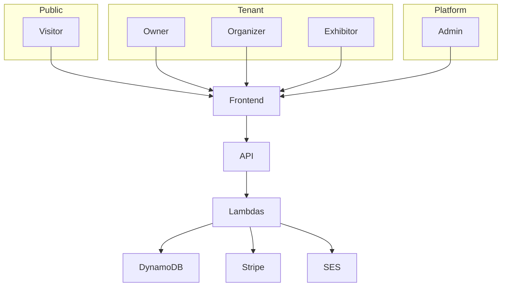

# Architettura completa di AI Pavilion 0.8.5

## Obiettivo

Descrivere il sistema in termini di confini, servizi, flussi sincroni e asincroni, dati e decisioni progettuali.

## Vista di contesto

AI Pavilion collega quattro categorie di utenti: amministratori di piattaforma, organizzatori, espositori e visitatori. Il browser accede a un frontend statico CloudFront/S3 e alle API serverless. Cognito autentica gli utenti, mentre il dominio multi-tenant è applicato dalle Lambda e da DynamoDB.

## Confini di sicurezza

1. Il browser non decide il ruolo.
2. API Gateway verifica il token Cognito sulle rotte protette.
3. La Lambda carica membership e risorsa.
4. Il controllo tenant confronta `organizationId` della membership e della risorsa.
5. Le risposte pubbliche sono proiezioni, non item DynamoDB grezzi.
6. Le mutazioni privilegiate producono audit tenant-scoped.

## Componenti

| Risorsa SAM | Handler | Responsabilità | Eventi/rotte | Dipendenze configurate |
| --- | --- | --- | --- | --- |
| GetStandsFunction | get-stands/index.handler | Elenca gli stand pubblici con pubblicazione fail-closed e paginazione. | GET /stands | EVENT_STANDS_INDEX, PUBLIC_STANDS_INDEX, STANDS_TABLE |
| GetStandDetailFunction | get-stand-detail/index.handler | Restituisce la proiezione pubblica di un singolo stand. | GET /stands/{standId} | STANDS_TABLE |
| SearchStandsFunction | search-stands/index.handler | Ricerca nel catalogo pubblico attraversando le pagine DynamoDB. | GET /stands/search | EVENT_STANDS_INDEX, PUBLIC_STANDS_INDEX, STANDS_TABLE |
| CheckoutFunction | checkout/index.handler | Gestisce il checkout dei prodotti, gli ordini e il webhook Stripe; nel pilot persistente è disabilitato per impostazione predefinita. | POST /checkout/create-intent POST /checkout/confirm-order GET /checkout/order/{orderId} POST /checkout/webhook | ORDERS_TABLE, PAYMENT_EVENTS_TABLE, PAYMENT_MODE, STANDS_TABLE, STRIPE_SECRET_KEY_ARN |
| AdminFunction | admin/index.handler | Espone dashboard, gestione stand, utenti, ordini e analytics per amministratori di piattaforma. | GET /admin/dashboard ANY /admin/stands ANY /admin/stands/{standId} GET /admin/users GET /admin/orders GET /admin/analytics | COGNITO_CLIENT_ID, COGNITO_USER_POOL_ID, INTERACTIONS_TABLE, ORDERS_TABLE, STANDS_TABLE, USERS_TABLE |
| UserSavedStandsFunction | user-saved-stands/index.handler | Gestisce i preferiti dell’utente autenticato. | GET /user/saved-stands POST /user/saved-stands DELETE /user/saved-stands/{standId} | SAVED_AT_INDEX, SAVED_STANDS_TABLE, STANDS_TABLE |
| UserAccountFunction | user-account/index.handler | Espone stato dell’account, bloccanti alla cancellazione e cancellazione sicura. | GET /user/account DELETE /user/account | COGNITO_USER_POOL_ID, MEMBERSHIPS_TABLE, ORDERS_TABLE, OWNER_STANDS_INDEX, SAVED_STANDS_TABLE, STANDS_TABLE, USERS_TABLE |
| UserOrdersFunction | user-orders/index.handler | Elenca gli ordini appartenenti all’utente autenticato. | GET /user/orders | ORDERS_TABLE, USER_ORDERS_INDEX |
| UserStatsFunction | user-stats/index.handler | Calcola statistiche personali basate su ordini pagati e preferiti. | GET /user/stats | ORDERS_TABLE, SAVED_STANDS_TABLE |
| ContactStandFunction | contact-stand/index.handler | Riceve lead pubblici con validazione, idempotenza, honeypot e challenge anti-bot configurabile. | POST /stands/contact | BOT_CHALLENGE_MODE, BOT_CHALLENGE_SECRET_ARN, LEADS_TABLE, STANDS_TABLE |
| TrackInteractionFunction | track-interaction/index.handler | Registra interazioni pubbliche consentite, non economiche e validate. | POST /interactions | STANDS_TABLE, TABLE_INTERACTIONS |
| OrganizationsFunction | organizations/index.handler | Gestisce organizzazioni, membership, ownership transfer ed entitlement. | GET /me/memberships POST /platform/organizations ANY /organizations/{organizationId} POST /organizations/{organizationId}/ownership-transfer ANY /organizations/{organizationId}/memberships ANY /organizations/{organizationId}/memberships/{userId} GET /organizations/{organizationId}/entitlement | AUDIT_TABLE, ENTITLEMENTS_TABLE, MEMBERSHIPS_TABLE, ORGANIZATIONS_TABLE, ORGANIZATION_MEMBERS_INDEX, USERS_TABLE |
| EventsFunction | events/index.handler | Gestisce ciclo di vita eventi, pubblicazione, archiviazione, duplicazione, assegnazione e moderazione stand. | ANY /organizations/{organizationId}/events ANY /organizations/{organizationId}/events/{eventId} POST /organizations/{organizationId}/events/{eventId}/duplicate POST /organizations/{organizationId}/events/{eventId}/archive POST /organizations/{organizationId}/events/{eventId}/publish GET /organizations/{organizationId}/events/{eventId}/stands PATCH /organizations/{organizationId}/events/{eventId}/stands/{standId}/assignment PATCH /organizations/{organizationId}/events/{eventId}/stands/{standId}/moderation | AUDIT_TABLE, ENTITLEMENTS_TABLE, EVENTS_TABLE, EVENT_STANDS_INDEX, MEMBERSHIPS_TABLE, ORGANIZATION_EVENTS_INDEX, STANDS_TABLE |
| InvitationsFunction | invitations/index.handler | Gestisce inviti, invio SES, accettazione, revoca e reinvio. | ANY /organizations/{organizationId}/events/{eventId}/invitations ANY /organizations/{organizationId}/events/{eventId}/invitations/{invitationId} POST /organizations/{organizationId}/events/{eventId}/invitations/{invitationId}/resend POST /invitations/{invitationId}/accept | APP_URL, AUDIT_TABLE, EMAIL_CONFIGURATION_SET, ENTITLEMENTS_TABLE, EVENTS_TABLE, EVENT_INVITATIONS_INDEX, EVENT_STANDS_INDEX, INVITATIONS_TABLE, INVITATION_EMAIL_FROM, INVITATION_EMAIL_MODE, MEMBERSHIPS_TABLE, ORGANIZATIONS_TABLE, STANDS_TABLE |
| ExhibitorStandsFunction | exhibitor-stands/index.handler | Consente all’espositore di leggere e modificare gli stand assegnati e inviarli in revisione. | GET /exhibitor/stands ANY /exhibitor/stands/{standId} POST /exhibitor/stands/{standId}/submit | AUDIT_TABLE, EVENTS_TABLE, OWNER_STANDS_INDEX, STANDS_TABLE |
| ExhibitorLeadsFunction | exhibitor-leads/index.handler | Consente all’espositore di consultare, esportare e aggiornare i lead dei propri stand. | GET /exhibitor/leads GET /exhibitor/leads/export PATCH /exhibitor/leads/{leadId} | AUDIT_TABLE, LEADS_TABLE, MEMBERSHIPS_TABLE, STANDS_TABLE, STAND_LEADS_INDEX |
| PublicEventsFunction | public-events/index.handler | Espone eventi pubblici e relativi stand. | GET /events GET /events/{eventId} GET /events/{eventId}/stands | EVENTS_TABLE, EVENT_STANDS_INDEX, PUBLIC_EVENTS_INDEX, STANDS_TABLE |
| BillingFunction | billing/index.handler | Gestisce billing SaaS Stripe, Checkout, Billing Portal, webhook e entitlement. | GET /organizations/{organizationId}/billing POST /organizations/{organizationId}/billing/checkout POST /organizations/{organizationId}/billing/portal POST /billing/webhook | APP_URL, AUDIT_TABLE, BILLING_MODE, ENTITLEMENTS_TABLE, MEMBERSHIPS_TABLE, ORGANIZATIONS_TABLE, PAYMENT_EVENTS_TABLE, STRIPE_PRICE_MAP, STRIPE_SECRET_KEY_ARN |
| EmailEventsFunction | email-events/index.handler | Elabora la telemetria SES/SNS relativa agli inviti. | SNS:InvitationEmailEvents | AUDIT_TABLE, INVITATIONS_TABLE |
| AuditViewFunction | audit-view/index.handler | Espone l’audit trail dell’organizzazione ai ruoli autorizzati. | GET /organizations/{organizationId}/audit | AUDIT_TABLE, MEMBERSHIPS_TABLE, ORGANIZATION_AUDIT_INDEX |
| DataExportFunction | data-export/index.handler | Genera l’esportazione dei dati personali dell’utente. | GET /user/export | MEMBERSHIPS_TABLE, ORDERS_TABLE, SAVED_STANDS_TABLE, USERS_TABLE, USER_ORDERS_INDEX, USER_SAVED_INDEX |
| PaymentReconciliationFunction | payment-reconciliation/index.handler | Riconcilia periodicamente webhook, ordini ed entitlement con Stripe. | Schedule:Schedule | BILLING_MODE, ENTITLEMENTS_TABLE, ORDERS_TABLE, PAYMENT_EVENTS_TABLE, PAYMENT_MODE, RECONCILIATION_MAX_ITEMS, RECONCILIATION_MAX_SCAN_PAGES, STALE_ORDER_MINUTES, STRIPE_SECRET_KEY_ARN |
| ProfileSyncFunction | profile-sync/index.handler | Crea o sincronizza il profilo applicativo dopo la conferma Cognito. |  | USERS_TABLE |

## Dati

| Risorsa | Nome fisico | Contenuto | Indici |
| --- | --- | --- | --- |
| StandsTable | ${AWS::StackName}-stands | Stand, prodotti incorporati, stato di moderazione, visibilità pubblica, assegnazione espositore. | category-index, event-stands-index, public-stands-index, owner-stands-index |
| OrdersTable | ${AWS::StackName}-orders | Ordini visitatore e stato di pagamento. | user-orders-index |
| PaymentEventsTable | ${AWS::StackName}-payment-events | Deduplicazione, lease e stato dei webhook Stripe. | — |
| UsersTable | ${AWS::StackName}-users | Profilo applicativo associato all’identità Cognito. | — |
| LeadsTable | ${AWS::StackName}-leads | Richieste di contatto generate dai visitatori. | stand-leads-index, organization-leads-index |
| InteractionsTable | ${AWS::StackName}-interactions | Eventi di engagement non economici. | stand-created-index, event-created-index |
| SavedStandsTable | ${AWS::StackName}-saved-stands | Preferiti degli utenti. | user-saved-at-index |
| OrganizationsTable | ${AWS::StackName}-organizations | Tenant cliente, piano, onboarding e owner. | organization-slug-index |
| MembershipsTable | ${AWS::StackName}-memberships | Appartenenza e ruolo dell’utente nell’organizzazione. | organization-members-index |
| EventsTable | ${AWS::StackName}-events | Eventi virtuali/ibridi, ciclo di pubblicazione e visibilità. | organization-events-index, public-events-index |
| InvitationsTable | ${AWS::StackName}-invitations | Inviti per espositori e collaboratori, stato di consegna. | email-invitations-index, event-invitations-index |
| EntitlementsTable | ${AWS::StackName}-entitlements | Piano SaaS, limiti e stato di sincronizzazione Stripe. | — |
| AuditEventsTable | ${AWS::StackName}-audit-events | Audit trail tenant-scoped. | organization-audit-index |
| SchemaMigrationsTable | ${AWS::StackName}-schema-migrations | Versioni e stato delle migrazioni dati. | — |

## Pattern principali

### Aggregato stand

Lo stand contiene contenuto, prodotti e stato di pubblicazione. È adeguato al pilot ma può diventare troppo grande o conteso a scala maggiore.

### Saga archiviazione

L’evento passa a `archiving`, viene nascosto e propaga lo stato agli stand. La finalizzazione è ripetibile.

### Lease webhook

Il primo worker acquisisce un evento con token e scadenza. Una lease scaduta può essere riacquisita. Un watermark temporale impedisce regressioni.

### Due stack applicativi

`template.yaml` è destinato allo sviluppo eliminabile. Il pilot usa template generati con retention e protezioni operative.

## Decisioni ancora aperte

- separare i prodotti dagli stand;
- introdurre un indice di ricerca dedicato;
- dividere le Lambda monolitiche;
- valutare BFF/cookie HttpOnly per la sessione;
- scegliere l’eventuale architettura marketplace in un progetto autonomo.
